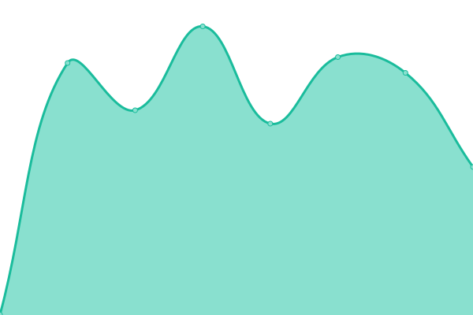
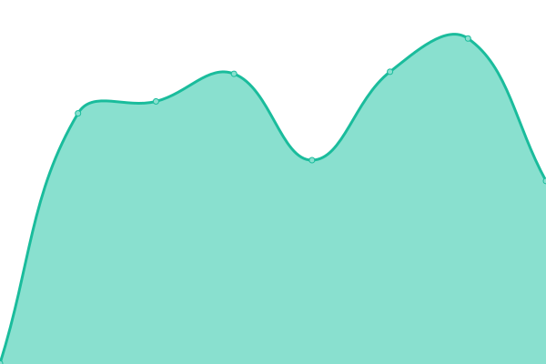

# [📈 Live Status](https://neophob.github.io/upptime): <!--live status--> **🟧 Partial outage**

This repository contains the open-source uptime monitor and status page for [Michael Vogt](http://www.neophob.com), powered by [Upptime](https://github.com/upptime/upptime).

With [Upptime](https://upptime.js.org), you can get your own unlimited and free uptime monitor and status page, powered entirely by a GitHub repository. We use [Issues](https://github.com/neophob/upptime/issues) as incident reports, [Actions](https://github.com/neophob/upptime/actions) as uptime monitors, and [Pages](https://neophob.github.io/upptime) for the status page.

<!--start: status pages-->
<!-- This summary is generated by Upptime (https://github.com/upptime/upptime) -->
<!-- Do not edit this manually, your changes will be overwritten -->
<!-- prettier-ignore -->
| URL | Status | History | Response Time | Uptime |
| --- | ------ | ------- | ------------- | ------ |
|  [Concealed Art](https://www.concealed-art.com/) | 🟥 Down | [concealed-art.yml](https://github.com/neophob/upptime/commits/HEAD/history/concealed-art.yml) | 

 0ms
     
 | 

<a href="https://neophob.github.io/upptime/history/concealed-art">0.00%</a>
    

|  [Playfield.dev](https://playfield.dev/) | 🟩 Up | [playfield-dev.yml](https://github.com/neophob/upptime/commits/HEAD/history/playfield-dev.yml) | 

 205ms
     
 | 

<a href="https://neophob.github.io/upptime/history/playfield-dev">100.00%</a>
    

|  [Update Server](http://update.revox.de) | 🟩 Up | [update-server.yml](https://github.com/neophob/upptime/commits/HEAD/history/update-server.yml) | 

 486ms
     
 | 

<a href="https://neophob.github.io/upptime/history/update-server">100.00%</a>
    

|  [NEEO](https://neeo.com/) | 🟩 Up | [neeo.yml](https://github.com/neophob/upptime/commits/HEAD/history/neeo.yml) | 

 342ms
     
 | 

<a href="https://neophob.github.io/upptime/history/neeo">99.82%</a>
    

<!--end: status pages-->

[**Visit our status website →**](https://neophob.github.io/upptime)

## 📄 License

- Powered by: [Upptime](https://github.com/upptime/upptime)
- Code: [MIT](./LICENSE) © [Michael Vogt](http://www.neophob.com)
- Data in the `./history` directory: [Open Database License](https://opendatacommons.org/licenses/odbl/1-0/)
